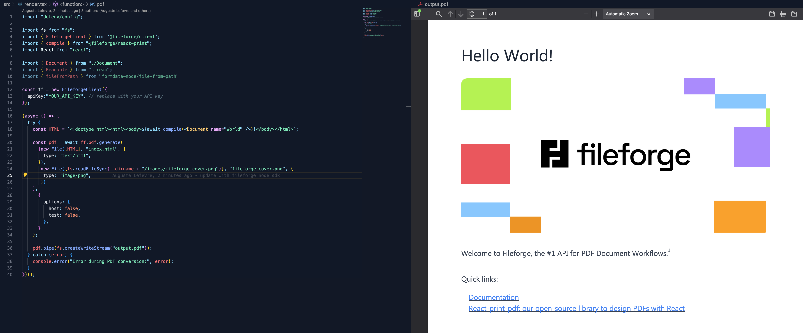

<div align="center"><strong>Dev Local</strong></div>
<div align="center">The new way to build documents.<br />High-quality, unstyled components for creating PDFs.</div>
<br />
<div align="center">
<a href="https://www.fileforge.com/">Website</a>
<span> · </span>
<a href="https://github.com/OnedocLabs/react-print">GitHub</a>
<span> · </span>
<a href="https://discord.com/invite/uRJE6e2rgr">Discord</a>
<span> · </span>
<a href="https://docs.fileforge.com">Documentation</a>
</div>

---

# Getting started

## 1. Installation

Clone the repository.

```
npm install
```

## 2. Set up environment

- Copy the .env.example file to .env and fill in the required fields.

```yaml
FILEFORGE_API_KEY="your_api_key"
```

- For a live rendering experience, split your IDE in two views, and open invoice.pdf in your right tab. You can use the [PDF Viewer](https://marketplace.visualstudio.com/items?itemName=mathematic.vscode-pdf) extension if you are using VS Code.

## 3. Render your first document$

```
npm run render
```

## 4. Have fun !

Build and render documents of your own in just one command line !

## 5. Remove the watermark

By default, this repository has `test: false` enabled in `./src/render.tsx`. To add the watermark and be in test mode, set `test: false` in `./src/render.tsx`.

